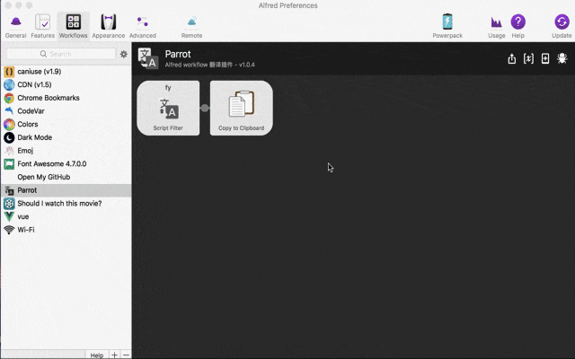

# alfred-parrot


##  🎉 更新
1. 支持 Alfred 4
2. 支持 macOS Catalina

## 👉 Install (安装)

```
$ npm install --global alfred-parrot
```

执行上述命令行后, 稍后会在 alfred workflow 中显示出安装后的 alfred-parrot

*Requires [Node.js](https://nodejs.org) 8+ and the Alfred [Powerpack](https://www.alfredapp.com/powerpack/).*

## 💻 Use (使用)


## 💪 More features (其他特性)

1. 朗读翻译结果, 输入 `fy` + `:`的形式, 如 `fy :thanks` ;
2. 多语种转换, `fy` + `空格` + `需要转换的单词` + `to` + `目标语言`, 如英转日: `fy thanks to 日语` 或 `fy love to jp`;
3. 复制翻译结果, 输入 `fy` 然后输入需要查询的单词,  如: fy love; 回车复制翻译结果

## 🌵 Language list supported (支持的语言列表)

1. 英语 (English)
2. 日语 (Japen)
3. 韩语 (Korea)
4. 法语 (Franch)
5. 西班牙语 (Spanish)

目前先暂时开放上述几种语言, 后期会添加更多, 如果你有其他语种翻译需求, 也可以发起 issues 告知我

## 😒 Config (用前配置)
> 自带的接口默认有调用频率限制, 很多人用的话可能会超出调用频率, 可以尝试配置自己的接口, 配置方式如下

支持有道和百度, 个人推荐使用有道,注册方式如下:

1. 注册[有道](http://ai.youdao.com/), 注册后复制自己的 `appid` 和 `key`  到 Alfred workflow 中
2. 注册[百度](http://api.fanyi.baidu.com/api/trans/product/index), 注册后复制自己的 `appid` 和 `key`  到 Alfred workflow 中

配置格式(json)

- 有道: `config_youdao: {"appid":"你的有道 appid", "key":"你的有道 key"}`
- 百度: `config_baidu: {"appid":"你的百度 appid", "key":"你的百度 key"}`

注: 如果同时配置了有道和百度, 会首先调用有道接口.



## 💙 最后

如果遇到任何问题, 可以提交 issue , 你的反馈对我很重要!
另外,喜欢的话不妨给个 Star 😍
If you Like , please give me star

## License

MIT © [haojen ma](http://haojen.github.io)
